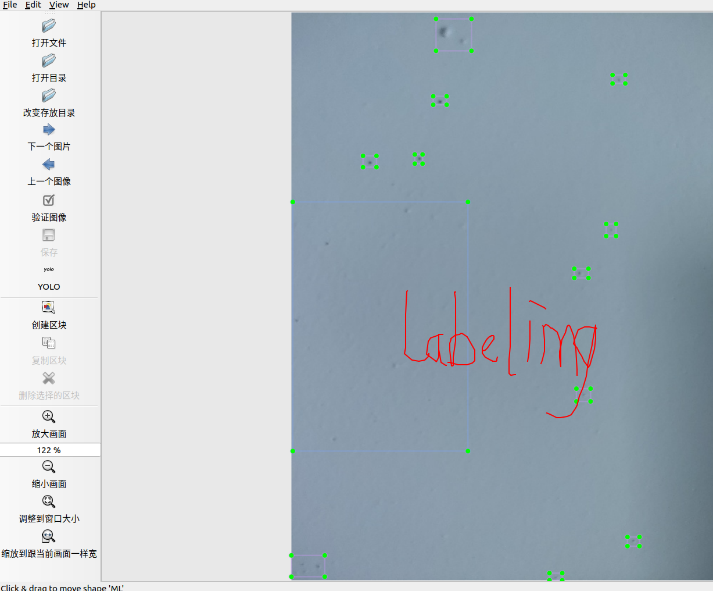

# 摘要

本文主要记录Ubuntu下yolov4数据的训练

-  安装opencv4
-  安装opencv_contrib
-  <a id=#sample_note>样本标注</a>
-  生成yolov4需要的数据集
-  配置GPU
-  修改yolov4网络配置参数
-  开始训练

>  默认前三步制作结束，本文主要从第四步生成YOLOV4所需要的数据开始


- [x] Edit By Porter, 积水成渊,蛟龙生焉。

<!-- more -->

<h2 id="sample_note"> 样本标注</h2>

使用labelimg标注工具得到yolo需要的txt格式的label标注文件，所以对于样本我们就有了原始图像数据集img文件和原始图片对应的标注文件label文件夹。如果是用pascolVOC我们可以通过xml转txt文件实现转换。公网IP购买

最终得到的：

- 样本集文件**image**
- 标签文件**label**



### 训练命令预览

接下来回顾下我们需要用到的训练命令

```bash
./build_release/darknet detector train data/my_dataset.data cfg/yolov4-my_dataset.cfg backup/yolov4-my_dataset.weights -map
```

### 训练配置文件修改

上面命令中的my_dataset.data 里面包含了训练样本图片的地址，训练样本的标签地址，内容如下：

```bash
$ cat cfg/porter.data  
classes= 8 #类别
train  = /home/porter/WorkSpace/YOLO4_test/YOLOV4/darknet/train.txt #你训练照片的路径集放入train.txt中
valid  = /home/porter/WorkSpace/YOLO4_test/YOLOV4/darknet/test.txt#你测试照片路径集放入test.txt中
names = /home/porter/WorkSpace/YOLO4_test/YOLOV4/darknet/data/porter.names#你的分类名字
backup = /home/porter/WorkSpace/YOLO4_test/YOLOV4/darknet/backup/#模型备份的路径
```

如上所示，需要训练集(train.txt)、验证集(test.txt)，需要分类的名字(porter.name)，需要模型备份地址(/back/)。所以接下来就是对样本进行训练集和测试集的划分。

我们需要制作成如下的训练/测试样本集的*.txt效果：

```bash
(base) porter@porter:~$ more home/porter/WorkSpace/YOLO4_test/YOLOV4/darknet/train.txt
/home/porter/WorkSpace/YOLO4_test/YOLOV4/darknet/VOCdevkit/VOC2007/JPEGImages/000113.jpg
/home/porter/WorkSpace/YOLO4_test/YOLOV4/darknet/VOCdevkit/VOC2007/JPEGImages/000244.jpg
/home/porter/WorkSpace/YOLO4_test/YOLOV4/darknet/VOCdevkit/VOC2007/JPEGImages/000222.jpg
/home/porter/WorkSpace/YOLO4_test/YOLOV4/darknet/VOCdevkit/VOC2007/JPEGImages/000250.jpg
/home/porter/WorkSpace/YOLO4_test/YOLOV4/darknet/VOCdevkit/VOC2007/JPEGImages/000077.jpg
```

##  生成yolov4需要的数据集

生成yolov4所需要的数据集，这个部分需要生成一个train.txt和2007_train.txt、test.txt和2007_test.txt。

这两个文件可以通过下面的python脚本实现，这里说下这两个文件的区别:

- 路径不同：train.txt位于**VOCdevkit/VOC2007/ImageSets/Main/**文件夹中。2007_train.txt位于**VOCdevkit/**中。test文件也是同样的。
- 两者的作用不同：train.txt主要是随机生成的照片名字的种类(其实这个文件可以不需要的，知识VOC格式里包含的而已)，而2007_train.txt主要是随机生成的包含样本集具体文件路径的样本(这个才是有用的)
- 两者文件夹的内容不同：train.txt主要是包含训练样本的图片名字。而2007_train.txt主要包含训练样本图片的绝对路径。

> 注意这个脚本应该放在YOLOV4/darknet/VOCdevkit/目录下运行，名字可以随便起


```python
import os
import random
import sys

'''
本脚本实现 【yolo格式的样本图片对应的txt标注文件】转为训练需要的文件。
本脚本首先会在VOCdevkit/VOC2007/ImageSets/Main下生成：
test.txt---测试样本集中随机分配的样本名字
train.txt---训练样本集中随机分配的样本名字
val.tat---验证集中随机分配的样本名字
trainval.txt---测试验证集中的样本名字

注意：本脚本应该放在：YOLOV4/darknet/VOCdevkit/目录下运行
运行命令为：python3 yolotxt_to_trian.txt.py ~/WorkSpace/YOLO4_test2/YOLOV4/darknet/VOCdevkit
'''

## 第一步、生成ImageSets/Main/中的train.txt
if len(sys.argv) < 2:-
    print("no directory specified, please input target directory")
    exit()

root_path = sys.argv[1]

xmlfilepath = root_path + '/VOC2007/labels'
txtsavepath = root_path + '/VOC2007/ImageSets/Main'

if not os.path.exists(root_path):
    print("cannot find such directory: " + root_path)
    exit()

if not os.path.exists(txtsavepath):
    os.makedirs(txtsavepath)

trainval_percent = 0.9
train_percent = 0.8
total_xml = os.listdir(xmlfilepath)
num = len(total_xml)
list = range(num)
tv = int(num * trainval_percent)
tr = int(tv * train_percent)
trainval = random.sample(list, tv)
train = random.sample(trainval, tr)

print("train and val size:", tv)
print("train size:", tr)

ftrainval = open(txtsavepath + '/trainval.txt', 'w')/darknet$ cat cfg/porter.data 
classes= 8
train  = /home/porter/WorkSpace/YOLO4_test2/YOLOV4/darknet/VOCdevkit/2007_train.txt 
valid  = /home/porter/WorkSpace/YOLO4_test2/YOLOV4/darknet/VOCdevkit/2007_val.txt
#valid = data/coco_val_5k.list
names = data/porter.names
backup = /home/porter/WorkSpace/YOLO4_test2/YOLOV4/darknet/backup/
ftest = open(txtsavepath + '/test.txt', 'w')
ftrain = open(txtsavepath + '/train.txt', 'w')
fval = open(txtsavepath + '/val.txt', 'w')-

for i in list:
    name = total_xml[i][:-4] + '\n'
    if i in trainval:
        ftrainval.write(name)
        if i in train:
            ftrain.write(name)
        else:
            fval.write(name)
    else:
        ftest.write(name)

ftrainval.close()
ftrain.close()
fval.close()
ftest.close()

## 第二步、生成训练配置文件添加的train.txt以及val.txt
# 生成训练样本的:
# val.txt
# train.txtYOLOV4/darknet/VOCdevkit/
import xml.etree.ElementTree as ET
import pickle
import os
from os import listdir, getcwd
from os.path import join

sets=[('2007', 'train'), ('2007', 'val'), ('2007', 'test')]

wd = getcwd()

for year, image_set in sets:
    # if not os.path.exists('VOCdevkit/VOC%s/labels/'%(year)):
    #     os.makedirs('VOCdevkit/VOC%s/labels/'%(year))
    image_ids = open('./VOC%s/ImageSets/Main/%s.txt'%(year, image_set)).read().strip().split()
    list_file = open('%s_%s.txt'%(year, image_set), 'w')
    for image_id in image_ids:YOLOV4/darknet/VOCdevkit/
        list_file.write('%s/VOC%s/JPEGImages/%s.jpg\n'%(wd, year, image_id))
        # convert_annotation(year, image_id)
    list_file.close()
YOLOV4/darknet/VOCdevkit/
os.system("cat 2007_train.txt 2007_val.txt 2007_test.txt")
```

```bash
python3 datahandle.py  ~/WorkSpace/YOLO4_test2/YOLOV4/darknet/VOCdevkit/VOC2007
```

执行上面的程序后将会在VOCdevkit/VOC2007/ImageSets/Main文件夹产生对应的train.txt，trainval.txt, test.py和val.txt，以及在VOCdevkit/文件下生成三个2007_train.txt, 2007_test.txt, 2007_val.txt文件夹。

### porter.names和porter.data配置

接下来配置yolo的训练配置文件：

/data/porter.names
/cfg/porter.data

```bash
/darknet$ cat data/porter.names
LP
LZ
SC
MH
ML
MD
WR
QT
```

以及

```bash
/darknet$ cat cfg/porter.data 
classes= 8
train  = /home/porter/WorkSpace/YOLO4_test2/YOLOV4/darknet/VOCdevkit/2007_train.txt 
valid  = /home/porter/WorkSpace/YOLO4_test2/YOLOV4/dYOLOV4/darknet/VOCdevkit/arknet/VOCdevkit/2007_val.txt
#valid = data/coco_val_5k.list
names = data/porter.names
backup = /home/porter/WorkSpace/YOLO4_test2/YOLOV4/darknet/backup/
```

### 配置makefile

我配置的makefile文件内容如下：

```bash
GPU=1
CUDNN=1
CUDNN_HALF=0
OPENCV=1
AVX=0
OPENMP=0
LIBSO=1
ZED_CAMERA=0
ZED_CAMERA_v2_8=0

接下来就可以开始训练了
# set GPU=1 and CUDNN=1 to speedup on GPU
# set CUDNN_HALF=1 to further speedup 3 x times (Mixed-precision on Tensor Cores) GPU: Volta, Xavier, Turing and higher
# set AVX=1 and OPENMP=1 to speedup on CPU (if error occurs then set AVX=0)
# set ZED_CAMERA=1 to enable ZED SDK 3.0 and above
# set ZED_CAMERA_v2_8=1 to enable ZED SDK 2.X

USE_CPP=0
DEBUG=0

ARCH= -gencode arch=compute_30,code=sm_30 \
      -gencode arch=compute_35,code=sm_35 \
      -gencode arch=compute_50,code=[sm_50,compute_50] \
      -gencode arch=compute_52,code=[sm_52,compute_52] \
	    -gencode arch=compute_61,code=[sm_61,compute_61]

OS := $(shell uname)

接下来就可以开始训练了
# Tesla A100 (GA100), DGX-A100, RTX 3080
# ARCH= -gencode arch=compute_80,code=[sm_80,compute_80]

# Tesla V100
# ARCH= -gencode arch=compute_70,code=[sm_70,compute_70]

# GeForce RTX 2080 Ti, RTX 2080, RTX 2070, Quadro RTX 8000, Quadro RTX 6000, Quadro RTX 5000, Tesla T4, XNOR Tensor Cores
# ARCH= -gencode arch=compute_75,code=[sm_75,compute_75]

# Jetson XAVIER
# ARCH= -gencode arch=compute_72,code=[sm_72,compute_72]

# GTX 1080, GTX 1070, GTX 1060, GTX 1050, GTX 1030, Titan Xp, Tesla P40, Tesla P4
# ARCH= -gencode arch=compute_61,code=sm_61 -gencode arch=compute_61,code=compute_61

# GP100/Tesla P100 - DGX-1
# ARCH= -gencode arch=compute_60,code=sm_60

# For Jetson TX1, Tegra X1, DRIVE CX, DRIVE PX - uncomment:
# ARCH= -gencode arch=compute_53,code=[sm_53,compute_53]

# For Jetson Tx2 or Drive-PX2 uncomment:
# ARCH= -gencode arch=compute_62,code=[sm_62,compute_62]


VPATH=./src/
EXEC=darknet
OBJDIR=./obj/

ifeq ($(LIBSO), 1)
LIBNAMESO=libdarknet.so
APPNAMESO=uselib
endif
html 字体颜色设置
ifeq ($(USE_CPP), 1)
CC=g++
else
CC=gcc
endif

CPP=g++ -std=c++11
NVCC=nvcc
OPTS=-Ofast
LDFLAGS= -lm -pthread
COMMON= -Iinclude/ -I3rdparty/stb/include
CFLAGS=-Wall -Wfatal-errors -Wno-unused-result -Wno-unknown-pragmas -fPIC

ifeq ($(DEBUG), 1)
#OPTS= -O0 -g
#OPTS
接下来就可以开始训练了= -Og -g
COMMON+= -DDEBUG
CFLAGS+= -DDEBUG
else
ifeq ($(AVX), 1)
CFLAGS+= -ffp-contract=fast -mavx -mavx2 -msse3 -msse4.1 -msse4.2 -msse4a
endif
endif

CFLAGS+=$(OPTS)

ifneq (,$(findstring MSYS_NT,$(OS)))
LDFLAGS+=-lws2_32
endif

ifeq ($(OPENCV), 1)
COMMON+= -DOPENCV
CFLAGS+= -DOPENCV
LDFLAGS+= `pkg-config --libs opencv4 2> /dev/null || pkg-config --libs opencv`
COMMON+= `pkg-config --cflags opencv4 2> /dev/null || pkg-config --cflags opencv`
endif

ifeq ($(OPENMP), 1)
    ifeq ($(OS),Darwin) #MAC
	    CFLAGS+= -Xpreprocessor -fopenmp
	else
		CFLAGS+= -fopenmp
	endif
LDFLAGS+= -lgomp
endif

ifeq ($(GPU), 1)
COMM
接下来就可以开始训练了ON+= -DGPU -I/usr/local/cuda/include/
CFLAGS+= -DGPU
ifeq ($(OS),Darwin) #MAC
LDFLAGS+= -L/usr/local/cuda/lib -lcuda -lcudart -lcublas -lcurand
else
LDFLAGS+= -L/usr/local/cuda/lib64 -lcuda -lcudart -lcublas -lcurand
endif
endif

ifeq ($(CUDNN), 1)
COMMON+= -DCUDNN
ifeq ($(OS),Darwin) #MAC
CFLAGS+= -DCUDNN -I/usr/local/cuda/include
LDFLAGS+= -L/usr/local/cuda/lib -lcudnn
else
CFLAG
接下来就可以开始训练了S+= -DCUDNN -I/usr/local/cudnn/include
LDFLAGS+= -L/usr/local/cudnn/lib64 -lcudnn
endif
endif

ifeq ($(CUDNN_HALF), 1)
COMMON+= -DCUDNN_HALF
CFLAGS+= -DCUDNN_HALF
ARCH+= -gencode arch=compute_70,code=[sm_70,compute_70]
endif

ifeq ($(ZED_CAMERA), 1)
CFLAGS+= -DZED_STEREO -I/usr/local/zed/include
ifeq ($(ZED_CAMERA_v2_8), 1)
LDFLA
接下来就可以开始训练了GS+= -L/usr/local/zed/lib -lsl_core -lsl_input -lsl_zed
#-lstdc++ -D_GLIBCXX_USE_CXX11_ABI=0
else
LDFLAGS+= -L/usr/local/zed/lib -lsl_zed
#-lstdc++ -D_GLIBCXX_USE_CXX11_ABI=0
endif
endif

OBJ=image_opencv.o http_stream.o gemm.o utils.o dark_cuda.o convolutional_layer.o list.o image.o activations.o im2col.o col2im.o blas.o crop_layer.o dropout_layer.o maxpool_layer.o softmax_layer.o data.o matrix.o network.o connected_layer.o cost_layer.o parser.o option_list.o darknet.o detection_layer.o captcha.o route_layer.o writing.o box.o nightmare.o normalization_layer.o avgpool_layer.o coco.o dice.o yolo.o detector.o layer.o compare.o classifier.o local_layer.o swag.o shortcut_layer.o activation_layer.o rnn_layer.o gru_layer.o rnn.o rnn_vid.o crnn_layer.o demo.o tag.o cifar.o go.o batchnorm_layer.o art.o region_layer.o reorg_
接下来就可以开始训练了layer.o reorg_old_layer.o super.o voxel.o tree.o yolo_layer.o gaussian_yolo_layer.o upsample_layer.o lstm_layer.o conv_lstm_layer.o scale_channels_layer.o sam_layer.o
ifeq ($(GPU), 1)
LDFLAGS+= -lstdc++
OBJ+=convolutional_kernels.o activation_kernels.o im2col_kernels.o col2im_kernels.o blas_kernels.o crop_layer_kernels.o dropout_layer_kernels.o maxpool_layer_kernels.o network_kernels.o avgpool_layer_kernels.o
endif

OBJS = $(addprefix $(OBJDIR), $(OBJ))
DEPS = $(wildcard src/*.h) Makefile include/darknet.h

all: $(OBJDIR) backup results setchmod $(EXEC) $(LIBNAMESO) $(APPNAMESO)

ifeq ($(
接下来就可以开始训练了LIBSO), 1)
CFLAGS+= -fPIC

$(LIBNAMESO): $(OBJDIR) $(OBJS) include/yolo_v2_class.hpp src/yolo_v2_class.cpp
	$(CPP) -shared -std=c++11 -fvisibility=hidden -DLIB_EXPORTS $(COMMON) $(CFLAGS) $(OBJS) src/yolo_v2_class.cpp -o $@ $(LDFLAGS)

$(APPNAMESO): $(LIBNAMESO) include/yolo_v2_class.hpp src/yolo_console_dll.cpp
	$(CPP) -std=c++11 $(COMMON) $(CFLAGS) -o $@ src/yolo_console_dll.cpp $(LDFLAGS) -L ./ -l:$(LIBNAMESO)
endif

$(EXEC): $(OBJS)
	$(CPP) -std=c++11 $(COMMON) $(CFLAGS) $^ -o $@ $(LDFLAGS)

接下来就可以开始训练了
$(OBJDIR)%.o: %.c $(DEPS)
	$(CC) $(COMMON) $(CFLAGS) -c $< -o $@

$(OBJDIR)%.o: %.cpp $(DEPS)
	$(CPP) -std=c++11 $(COMMON) $(CFLAGS) -c $< -o $@

$(OBJDIR)%.o: %.cu $(DEPS)
	$(NVCC) $(ARCH) $(COMMON) --compiler-options "$(CFLAGS)" -c $< -o $@

$(OBJDIR):
	mkdir -p $(OBJDIR)
backup:
	mkdir -p backup
results:
	mkdir -p results
setchmod:
	chmod +x *.shtest

.PHONY: clean

clean:
	rm -rf $(OBJS) $(EXEC) $(LIBNAMESO) $(APPNAMESO)
```

### 配置yolo 网络结构

#### yolov4-my_dataset.cfg主要是模型配置文件

.cfg文件配置主要有三个地方，分别对应三个：

- 开头部分修改：

```bash
[net]
# Testingtest
#batch=1
#subdivisions=1
# Training
batch=64 #讲训练样本分为64个batch来训练，更新模型前的样本每一批的样本，共分为64批次。
subdivisions=64  #在没批次中， 分多少次取这一批次中的样本
width=640 # 你图片的大小
height=480 # 你图片的大小
channels=3
momentum=0.949
decay=0.0005
angle=0
saturation = 1.5
exposure = 1.5
hue=.1

learning_rate=0.001
burn_in=1000
max_batches = 8000 # 2000*num_classes
policy=steps
steps=6400,7200 # max_batches*80%,max_batches*9./darknet detector test data/obj.data cfg/yolo-obj.cfg yolo-obj_8000.weights0%
scales=.1,.1
```

每个yolo layer 前的最后一个conv内容

```bash
# step1: 修改batch和subdivisions
L2: batch=64                # 原来就是64,根据gpu自己选择
L3: subdivisions=16         # 原来是8，根据自己的gpu选择
 #### 
# step2: 修改图片的尺寸
L7: width=608               # 这边我就不进行修改了
L8: height=608              # 这边我也不修改
 #### 
# step3: 修改classes(每个yolo层都需test要修改一次，一共需要修改三次)
L968: classes=2             # 我只需要识别两类物体，因此需要修改成2
L1056: classes=2
L1144: classes=2
 
# step4: 需要修改每个yolo相邻的上一个convolution层的filter
L961: filters=21            # 因为我预测两类物体：21 = 3*(5+2)
L1049: filters=21
L1137: filters=21
```


### 执行make指令

```bash
make
```


### 开始训练

```bash
./darknet detector train data/my_dataset.data cfg/yolov4-my_dataset.cfg backup/yolov4-my_dataset.weights -map
```

### 开始测试

```bash
./darknet detector test ./cfg/porter.data ./cfg/porter.cfg ./back/yolov4.weights
```